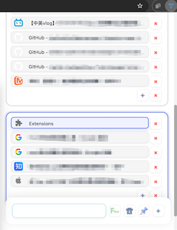
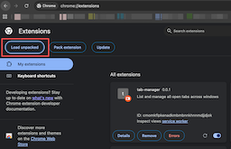

# Tab Manager - Chrome Extension

**LESS TAB, HIGHER EFFICIENCY!!**

## ✨ Preview

- Click extension icon:

- You will get:

## 📦 How to use

1. Clone the repository or download as a ZIP file
2. Open the directory and run `npm run build:full` to build the extension
3. Open Chrome and go to `chrome://extensions/`
4. Enable **Developer mode** in the top right corner
5. Click **"Load unpacked"**
6. Select the `dist` folder

## 🎯 Features

- 📑 View all tabs across all windows
- 🔍 Search and filter tabs
- 🗑️ Bulk delete tabs
- 📌 Pin / unpin tabs
- 🪟 Move selected tabs to a new window

## 🚀 Development guide

1. Run `npm install` to install dependencies
2. Edit the source code in `src/`
3. Run `npm run build:full` to build the extension
4. Go to `chrome://extensions/` and click the **🔄 Reload** button on the extension
5. Reopen the popup to see your changes

## 🐛 Common questions

**No changes after editing code?**
Re-run `npm run build:full`, then reload the extension at `chrome://extensions/`.

**Extension fails to load?**
Make sure `npm run build:full` has been run and the `dist/` folder exists.

**TypeScript compile errors?**
Run `npm run type-check` to see the exact error locations.

**Favicon not showing?**
Make sure `"favicon"` is listed in the `permissions` field of `manifest.json`.

## 📄 Any question?

Just leave me a message
