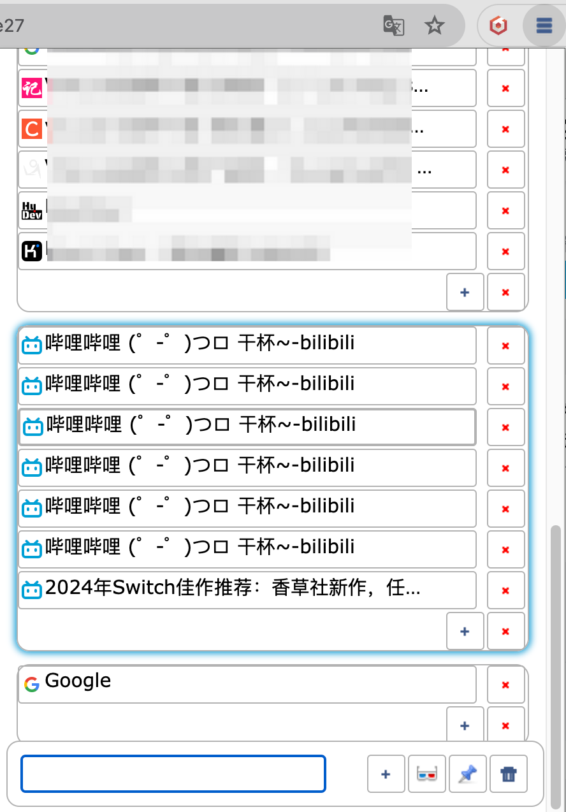

# Tab Manager - Chrome Extension

Chrome浏览器标签页管理扩展

## ✨ Features

It looks like this:

如果你也是 tab 大王（orz），可以用来管理 tab
不用切换 chrome window 直接把多余 tab 关闭

## 🚀 开发指南

### 安装依赖

\`\`\`bash
npm install
\`\`\`

### 开发模式（带热重载）

\`\`\`bash
npm run dev
\`\`\`

### 构建生产版本

\`\`\`bash
npm run build
\`\`\`

构建产物会输出到 `dist/` 目录。

### 类型检查

\`\`\`bash
npm run type-check
\`\`\`

## 📦 安装扩展

1. 运行 `npm run build` 构建扩展
2. 打开Chrome浏览器，访问 `chrome://extensions/`
3. 启用右上角的"开发者模式"
4. 点击"加载已解压的扩展程序"
5. 选择 `dist` 文件夹

## 🎯 功能特性

- 📑 查看所有窗口的标签页
- 🔍 搜索过滤标签页
- 🗑️ 批量删除标签页
- 📌 固定/取消固定标签页
- 🪟 将选中的标签页移动到新窗口
- 🎨 支持垂直/块状布局
- 🔒 识别隐身模式标签页

## ⌨️ 快捷键

- **Ctrl+Shift+F** (Windows/Linux) 或 **MacCtrl+Shift+F** (macOS)：打开标签页管理器
- **Shift/Ctrl + 点击**：多选标签页
- **拖拽**：重新排列标签页
- **中键点击**：关闭标签页

## 📁 项目结构

\`\`\`
tab-manager/
├── src/
│ ├── components/
│ │ ├── Tab.tsx # 单个标签页组件
│ │ ├── Window.tsx # 窗口组件
│ │ └── TabManager.tsx # 主管理组件
│ ├── types.ts # TypeScript类型定义
│ ├── background.ts # Service Worker
│ └── popup.tsx # 入口文件
├── images/ # 图标资源
├── manifest.json # 扩展清单（V3）
├── popup.html # 弹出页面
├── popup.css # 样式文件
├── vite.config.ts # Vite配置
├── tsconfig.json # TypeScript配置
└── package.json # 项目配置
\`\`\`

## 🔧 技术栈

- **React 18**: 现代UI框架
- **TypeScript 5**: 类型安全
- **Vite 5**: 快速构建工具
- **Chrome Extension Manifest V3**: 最新扩展规范

## 📄 许可证

MIT
